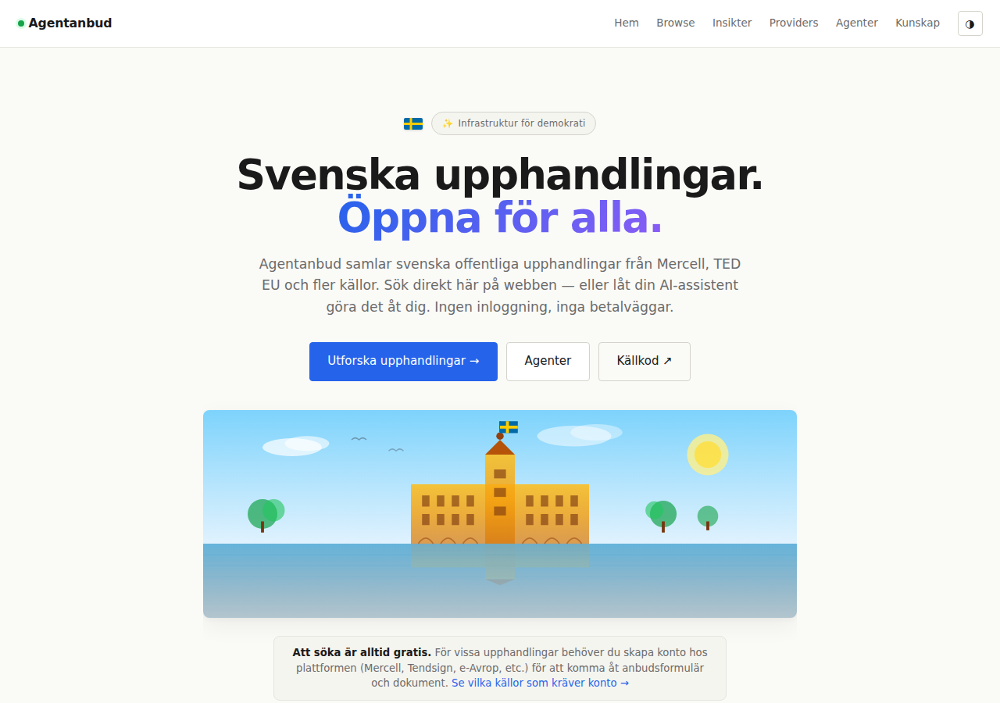

# Agentanbud

> **Svenska upphandlingar — fri tillgång, en SQLite, en container.**
> Open by design. Data är dina medborgares rättighet.



Agentanbud samlar in offentlig upphandlingsdata från Mercell och TED EU,
lagrar allt i en lokal SQLite, och serverar den på tre sätt: en webbdashboard,
ett öppet JSON API, och en **MCP-server** så att AI-agenter (Claude Code,
Codex CLI, Cursor, Kilo Code m.fl.) kan söka och läsa upphandlingar direkt i
sina arbetsflöden. Allt-i-ett-container, deployas till Easypanel via en
`docker-compose.yml`. Inga molntjänster, inga API-nycklar, inga paywalls.

**Varför det här finns:** Svenska myndigheter måste enligt lag publicera
upphandlingar enligt offentlighetsprincipen, men det finns ingen samlad
publik tjänst som gör datan lätt att upptäcka, jämföra och bevaka. Vi
tycker att medborgare, småföretagare och ideella organisationer förtjänar
samma tillgång som de stora konsultbolagen.

---

## 🇸🇪 Vårt uppdrag

Svenska myndigheter måste enligt lag publicera upphandlingar enligt **offentlighetsprincipen** — men det finns ingen samlad öppen plats där datan är lätt att hitta, jämföra och bevaka. Stora konsultbolag har råd att betala plattformar, byta källa, skriva anbud. Småföretag gör det inte.

Agentanbud finns för att **minska informationsasymmetrin**. Vi speglar publik upphandlingsdata, gör den sökbar, och ger AI-agenter direktåtkomst via MCP. Målet är inte att konkurrera med Mercell, Tendsign, e-Avrop eller Clira — utan att ge svenska småföretag samma möjlighet att **hitta** anbud som de stora har.

> "Sharing is caring" — men vi tar det längre: vi delar **hela ekosystemet** (kod, data, utbildning) så att fler kan bygga bättre verktyg ovanpå.

**Respekt före aggresion:** vi respekterar `robots.txt`. Vi kontaktar plattformar istället för att kringgå dem. Vi speglar bara det som plattformarna själva publicerat publikt. Om en plattform säger nej, säger vi också nej (e-Avrop är vårt första exempel — se `/providers`).

## 🎯 Tre principer

1. **Fri tillgång** — koden är MIT-licensierad, datan är publik, API:t är
   fritt. Inga betalväggar, inga konton, inga kontaktuppgifter för att
   "få tillgång".
2. **Enkel att driva** — en container, en SQLite-fil, en cron-rad. Kan köras
   på en Hetzner-VPS för €4/mån eller på din laptop. Backup = `cp`.
3. **Lokal först** — vi skickar inte data till molnplattformar vi inte äger.
   All data bor i din egen SQLite, under din egen kontroll.

---

## Arkitektur

```
┌───────────────────────────────────────────────────┐
│  Easypanel service: agentanbud                    │
│  (single container via docker-compose)            │
│                                                   │
│  ┌──────────────┐  ┌────────────────────────────┐ │
│  │ cron 06:00   │  │ FastAPI (uvicorn)          │ │
│  │  ↓           │  │  /            (dashboard)  │ │
│  │  scraper     │  │  /api/*       (JSON API)   │ │
│  │   • mercell  │  │  /mcp         (MCP server) │ │
│  │   • ted      │  │  /analytics   (usage insyn)│ │
│  │  ↓           │──│  reads/writes ───→ SQLite  │ │
│  └──────────────┘  └────────────────────────────┘ │
│                  ↳ /data/application.db             │
└───────────────────────────────────────────────────┘
          ↕ HTTPS
       Traefik (Easypanel)
          ↕
  Webbläsare · AI-agenter (MCP) · Egna script (REST)
```

**Inga Supabase-konton, inga externa databaser, inga buildpacks, inga
hemligheter att hantera.** Allt-i-ett, läs SQLite direkt om du vill.

---

## 🚀 Deploy till Easypanel (3 minuter)

1. Easypanel → **Create Service → Docker Compose**
2. **Source:** `https://github.com/magnusfroste/agentanbud`
3. **Domain:** t.ex. `upphandling.dindomän.se` (HTTPS auto)
4. **Deploy**

Klart. Första sync körs kl 06:00 (eller ställ in egen `CRON_SCHEDULE`).

## 🐳 Lokal test

```bash
git clone https://github.com/magnusfroste/agentanbud.git
cd agentanbud
docker compose up --build
# → http://localhost:8080
```

För att köra en synk manuellt (utan att vänta på cron):

```bash
docker compose exec app python -m scraper.orchestrator
```

---

## 📊 API

Alla endpoints är read-only, ingen auth, inga tokens.

| Endpoint | Beskrivning |
|---|---|
| `GET /` | Dashboard (vanilla HTML, ingen build) |
| `GET /api/health` | Hälsa + senaste sync |
| `GET /api/stats` | KPI:er + senaste 20 syncs + top-15 upphandlare |
| `GET /api/tenders?source=&q=&page=&page_size=` | Paginerad lista, max 200/sida |
| `GET /api/tenders/{id}` | Enskild upphandling (inkl. `raw_json`) |
| `GET /docs` | Swagger UI (auto-genererad av FastAPI) |

**Exempel:**

```bash
# Hämta alla IT-upphandlingar
curl 'http://localhost:8080/api/tenders?q=it&page=1'

# Hämta bara TED-notiser
curl 'http://localhost:8080/api/tenders?source=ted'

# Hämta en specifik upphandling (inkl. hela raw_json)
curl 'http://localhost:8080/api/tenders/42'
```

Svaret är rent JSON. Bygg din egen frontend, integrera i ditt CRM, eller
använd det från en Jupyter notebook — your call.

---

## 🤖 MCP — för AI-agenter

Agentanbud exponerar samma data via [Model Context Protocol](https://modelcontextprotocol.io/)
på `https://www.agentanbud.se/mcp` — read-only, ingen API-nyckel, inga
konton. AI-agenter kan ansluta med bara en URL och får **10 verktyg** direkt:

| Tool | Beskrivning |
|---|---|
| `search_tenders` | Sök upphandlingar (fritext, källa, upphandlare, CPV, öppen/stängd) |
| `get_tender` | Hämta en specifik upphandling |
| `match_profile` | Matcha upphandlingar mot en profil — nyckelord, CPV-prefix, regioner |
| `get_authority` | Alla upphandlingar från en organisation, t.ex. Trafikverket |
| `get_stats` | Databasöversikt + senaste sync |
| `list_providers` | Datakällor + om ansökan kräver konto |
| `list_regions` | Län med upphandlingar |
| `list_cpv_top` | Vanligaste CPV-kategorierna |
| `search_knowledge` | Sök i kunskapsbanken (hållbarhetskriterier + Q&A) |
| `get_knowledge` | Hämta ett kunskapsobjekt i detalj |

**Anslut från Claude Code** (ett kommando):

```bash
claude mcp add --transport http agentanbud https://www.agentanbud.se/mcp
```

**Anslut från Codex CLI** — lägg till i `~/.codex/config.toml`:

```toml
[mcp_servers.agentanbud]
url = "https://www.agentanbud.se/mcp"
```

**Övriga MCP-klienter** (Cursor, Windsurf, Kilo Code, Cline m.fl.):

```json
{
  "mcpServers": {
    "agentanbud": {
      "url": "https://www.agentanbud.se/mcp",
      "transport": "streamable-http"
    }
  }
}
```

Fullständig dokumentation, cookbook-exempel och lokal (stdio) installation:
se [MCP.md](MCP.md). Guide för samtliga anslutningssätt (webb-prompt, MCP,
REST) finns även på [/agenter](https://www.agentanbud.se/agenter).

### 📈 Öppen insyn i användningen

[/analytics](https://www.agentanbud.se/analytics) visar vad som faktiskt
söks på — och om sökningen kom från webbläsaren, en MCP-agent eller REST
API:t. Samma idé som transparenssidan i [clawable.org](https://www.clawable.org):
om vi bygger infrastruktur för agenter ska det synas hur den används,
inte bara att den finns.

**Inga cookies, ingen tredjepartsanalys.** Loggen är vår egen — kanal,
sökterm och tidpunkt i vår egen SQLite, inget Google Analytics eller
Mixpanel, ingen IP-adress eller besökar-ID som kopplar en sökning till
en person.

---

## 🌍 Datakällor

### Live upphandlingar (tenders)

| Källa | Typ | Status |
|---|---|---|
| **Mercell** | Publik JSON-API | ✅ Live (~500 SE records) |
| **TED EU** (Contract Notices) | Publik JSON-API (POST) | ✅ Live (~6 500 / 90d) |
| **TED EU Awards** | Samma API, notice-subtype 16-19 | ✅ Live (~3 500 / 90d) |
| **TED EU PIN** | Samma API, notice-subtype 4,5,25,26 | ✅ Live (~180 / 90d) |
| **Upphandlingsmyndigheten LOV** | Publik JSON-API | ✅ Live (~429 st) |
| Tendsign / MeForm | Inget öppet API | 🔴 Kräver Selenium (PRs välkomna!) |
| e-Avrop | robots.txt Disallow: / | 🔴 Respekterat — ingen scraping |
| Kommersannons | Inget öppet API | 🔴 Vanilla HTTP-scrape möjligt |
| Clira / Esource | Sanctum-skyddat | 🔴 Kräver konto/headless browser |

### Kunskapsbas (knowledge)

Separata från upphandlingar — referensmaterial från Upphandlingsmyndigheten.

| Källa | Vad | Status |
|---|---|---|
| **Hållbarhetskriterier** | Miljökrav per bransch — IT, transport, livsmedel etc. | ✅ Live (~743 st) |
| **Frågeportalen** | Juridisk Q&A om LOU, LOV, tröskelvärden etc. | ✅ Live (~150 unika) |

Kunskapsbasen exponeras via `/kunskap` (HTML) + `/api/knowledge` (JSON)
+ MCP-tools `search_knowledge` / `get_knowledge`. Sökbart via webben och
direkt från AI-agenter. Användbart för att svara på frågor som "vilka
miljökrav gäller typiskt vid IT-upphandling?" eller "vad är LOU?".

**Mercell ensamt täcker 65–70% av svensk upphandlingsvolym** (vi verifierade
det genom att jämföra deras `sourceId`-lista med kända aggregatorers
`source_url`-domäner — Mercell speglar MeForm, e-Avrop, Kommersannons).

**Vill du lägga till en datakälla?** Öppna en PR med en ny `scraper/*.py`
som implementerar `run(db_path) -> int`. Registrera den i
`scraper/orchestrator.py:_registry()`. Klart.

---

## 🗄️ Schema

`tenders` speglar de publika fälten — schema är public-only, inga PII.

```sql
CREATE TABLE tenders (
    id INTEGER PRIMARY KEY AUTOINCREMENT,
    source_system TEXT NOT NULL,         -- 'mercell' | 'ted' | ...
    source_id TEXT NOT NULL,             -- unik ID inom källan
    tender_url TEXT,                     -- kanonisk deeplänk
    title TEXT,
    authority TEXT,                      -- upphandlande myndighet
    cpv_codes TEXT,                      -- JSON-lista med CPV-koder
    deadline TEXT,                       -- ISO8601
    published_at TEXT,                   -- ISO8601
    description TEXT,
    value REAL,
    procedure TEXT,                      -- t.ex. "Open procedure"
    contract_type TEXT,
    document_type TEXT,
    region TEXT,
    raw_json TEXT,                       -- hela källposten (för debugging)
    fetched_at TEXT DEFAULT CURRENT_TIMESTAMP,
    UNIQUE(source_system, source_id)     -- idempotenta synkar
);
```

`sync_log` loggar varje körning per källa (för dashboardens "senaste syncs").

**Inspektera direkt med `sqlite3`-CLI:**

```bash
sqlite3 data/application.db
sqlite> .schema
sqlite> SELECT source_system, COUNT(*) FROM tenders GROUP BY source_system;
sqlite> SELECT title, authority FROM tenders WHERE cpv_codes LIKE '%72%' LIMIT 5;
```

---

## 🤝 Bidra

Vi vill ha bidrag. Speciellt:

- **Nya datakällor** — Tendsign, e-Avrop, Kommersannons. Varje scraper är
  en ~150-rad fil som implementerar `run(db_path) -> int`.
- **Frontend-förbättringar** — dashboarden är vanilla HTML, ingen build.
  Maps, filter, export-knappar, dark mode — allt välkommet.
- **CPV-mappning** — `cpv_codes` lagras råa. En `cpv_labels` JOIN-tabell
  med svenska etiketter (via `cpv-eu`-biblioteket) skulle ge oss sökbar
  kategorisering.
- **Notifieringar** — e-post/RSS när nya upphandlingar matchar en query.

Inget bidrag är för litet. Öppna en issue först om du vill diskutera
innan du kodar.

---

## 📜 Licens

**MIT** — gör vad du vill med koden.

**Data:** Varje källas egna villkor gäller för den underliggande datan.
Vi speglar den inte — vi pekar bara vidare via `tender_url` till
originalkällan. Om en myndighet tar bort en annons försvinner den från
vår databas vid nästa sync, men den fysiska posten finns kvar i
`raw_json` om du har en lokal kopia.

---

## 🙏 Inspiration

- `magnusfroste/openjobs-api` — samma mikroservice-pattern, för jobb
- Magto/upphandling-matcher — Mercell-scraper vi portade
- `isakskogstad/Upphandlingsdata-MCP` — MCP-server för samma datakällor
- Den publika `cpv-cache.wizflow.ai/cpv/nested` — CPV-trädet

Tack till alla som byggt verktyg vi kunde stå på.
